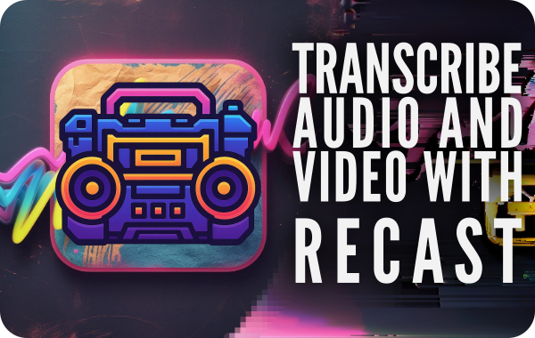
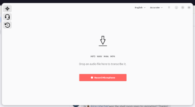
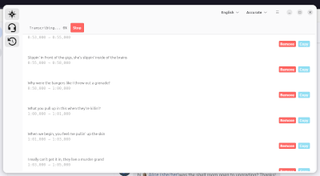
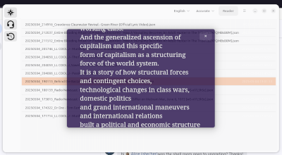

# ReCast
A desktop application for audio and video transcription on the GNOME desktop.

[](promores/default.png)
[](promores/transcription.png)
[](promores/reader.png)


## Core Features

✅   Transcribe local audio and video files.

✅   View real-time transcription progress and segment display.

✅   Display segmented and full transcripts.

✅   Manage transcription models used by `faster-whisper`.

✅   View a history of previous transcriptions.

✅   Export transcripts to various formats.

## Technology

GnomeRecast is built using:

*   Python
*   GTK4
*   Adwaita
*   `faster-whisper` library for transcription

## Target Audience

This application is primarily intended for GNOME desktop users who need an efficient, offline tool for transcribing audio and video content.

## Getting Started

### Highly experimental flatpak

to install the flatpak from the very experimental beta release:
```bash
# download the flatpak
# run the following command:
flatpak install --user recast.flatpak

# dependencies:
org.gnome.Platform branch 47.
```

### To run from source (example):

```bash
# Clone the repository (if applicable)
# git clone <repository-url>
# cd gnomerecast

# Install dependencies (example)
# pip install -r requirements.txt

# Run the application
python src/main.py
```

## Status

Recast is currently under active development.
